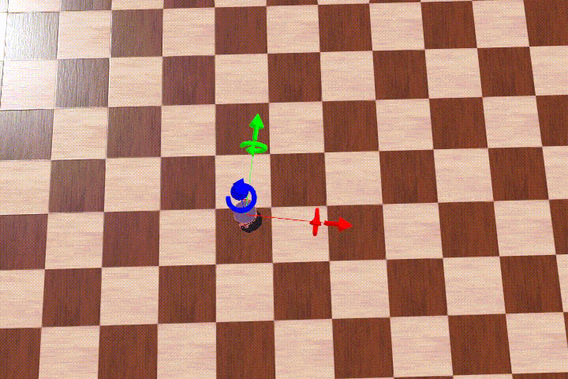

# Simulacion_Control_Sistemas_Roboticos
Este proyecto fue desarrollado con con Python 3.7.
Para utilizar el repositorio instalar las librerias necesarias 
```bash
pip install -r requirements.txt
``` 
Una vez completada la instalacion de librerias ejecutar 
```bash
jupyter-notebook
``` 
Los códigos de Python relacionados con preliminares matemáticos (Capitulo 1)se encuentran en la siguiente carpeta /Preliminares/Python

## Simulacion y control de un robot movil

A continuacion se muestra los resultados del Capitulo 6, relacionado al control de un robot movil.


<p float="left">
    
 </p>

## Simulacion y control de un robot manipulador

A continuacion se muestra los resultados del Capitulo 6, relacionado al control de un robot manipulador.

<p float="left">
    
 </p>